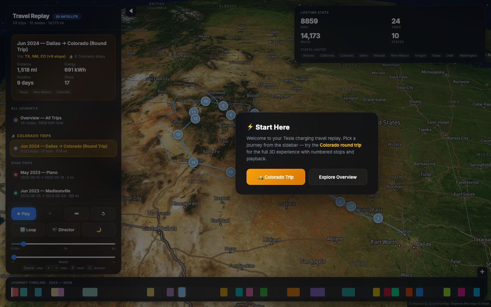
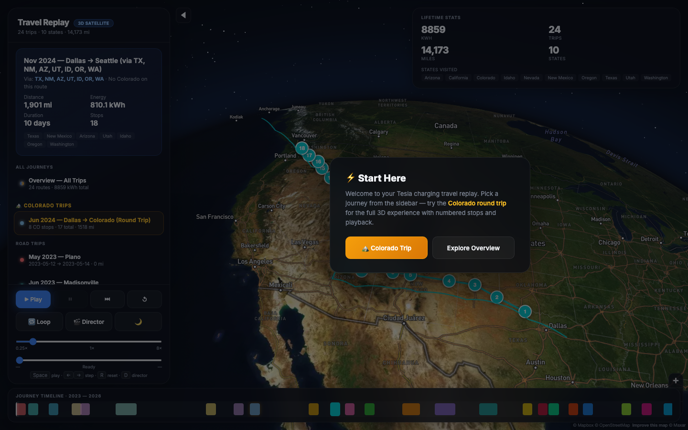

# Tesla Charging Travel Map

A cinematic 3D replay of Tesla Supercharger road trips — built from your charging history CSV exports. Satellite terrain, elevated route arcs, trip playback, and a polished dashboard.


## Live demo

**https://ramkandimalla94.github.io/tesla-charging-travel-map/**

On first visit, paste your [Mapbox public token](https://account.mapbox.com/access-tokens/) — it's stored in your browser only. For zero-prompt deploys, add `MAPBOX_TOKEN` as a GitHub Actions secret and push the workflow file (see below).

## Features

- **Road-following routes** via Mapbox Directions API (cached in `data/routes_cache.json`)
- **3D satellite map** with Mapbox terrain and deck.gl elevated arcs
- **24 segmented trips** across 10 states — 8,859 kWh · 14,173 miles
- **Trip playback** with director-mode camera, scrubber, and keyboard shortcuts
- **Colorado highlight** — dedicated section for the Dallas → Colorado round trip
- **Night mode**, timeline scrubber, GPX export per trip

## Screenshots

| Overview | Colorado trip | Seattle trip |
|----------|---------------|--------------|
|  |  |  |

## Quick start (local)

```bash
git clone https://github.com/ramkandimalla94/tesla-charging-travel-map.git
cd tesla-charging-travel-map
python3 -m venv .venv && source .venv/bin/activate
pip install -r requirements.txt

# Add your Mapbox token (free tier at mapbox.com)
cp .env.example .env
# Edit .env → MAPBOX_TOKEN=pk.eyJ...

# Build map from committed trip data
python scripts/build_map.py

# Refresh driving routes from Mapbox (requires MAPBOX_TOKEN)
python scripts/build_map.py --refresh-routes

# Serve locally (Mapbox requires HTTP, not file://)
python -m http.server 8765
open http://127.0.0.1:8765/output/travel_map.html
```

### Full pipeline (with your own CSV exports)

Place Tesla charging CSV exports in the project root, then:

```bash
python scripts/merge_csvs.py
python scripts/geocode_locations.py   # first run only
python scripts/segment_trips.py
python scripts/build_map.py
```

CSV exports are **not committed** (personal data). Only processed `data/trips.json` is in the repo.

## GitHub Pages setup

**Already live** at https://ramkandimalla94.github.io/tesla-charging-travel-map/ (public build — enter Mapbox token once in browser).

For automatic CI deploys with your token baked in at build time:

1. `MAPBOX_TOKEN` is already set as a repository secret
2. Enable Pages source: **GitHub Actions** (Settings → Pages)
3. Grant workflow scope and push the workflow file:
   ```bash
   gh auth refresh -s workflow
   git add .github/workflows/pages.yml && git commit -m "Add Pages CI workflow" && git push
   ```

## Browser verification

```bash
python -m http.server 8765 &
python scripts/verify_map.py
```

Playwright captures screenshots to `docs/screenshots/` and asserts Colorado stops render in bounds.

## Project structure

```
scripts/
  merge_csvs.py       # Dedupe Tesla CSV exports
  geocode_locations.py
  segment_trips.py    # Multi-signal trip segmentation
  build_map.py        # Generate HTML + GeoJSON + GPX
  verify_map.py       # Playwright browser tests
  templates/travel_map.html.j2
data/
  trips.json          # Segmented trips (committed)
  locations_cache.json
output/               # Generated (gitignored except GPX/GeoJSON)
```

## Keyboard shortcuts

| Key | Action |
|-----|--------|
| Space | Play / pause |
| ← → | Step stops |
| R | Reset |
| D | Director camera |

## License

Personal project — charging location data is derived from your own Tesla account exports.
