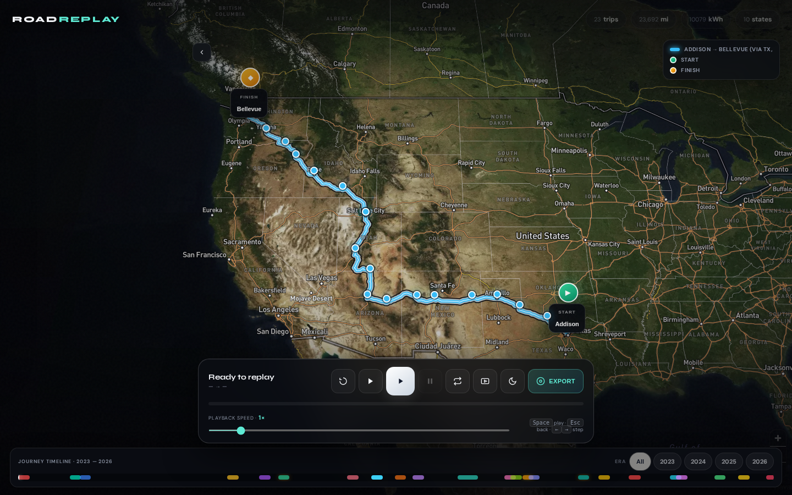
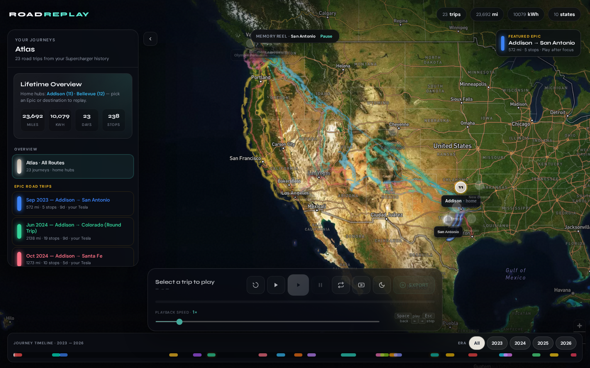

# Tesla Charging Travel Map

Turn your Tesla Supercharger history into **Instagram-ready trip videos** — cinematic 3D satellite replay with time-accurate pacing, location labels, and one-click export.


## Live demo

**https://ramkandimalla94.github.io/tesla-charging-travel-map/**

Opens the map immediately — the Mapbox **public** token (`pk.…`) is baked into the Pages build as base64 (decoded in the browser) so GitHub push protection does not block `gh-pages` deploys. Do not use a secret `sk.…` token.

Every merge to `main` rebuilds this site via GitHub Actions (`.github/workflows/pages.yml`) and publishes to the `gh-pages` branch. The URL above stays the same; the map content updates after a successful deploy.

## Features

- **Atlas overview** — home hubs + destination constellation + hub→destination spokes with corridor banding for repeat destinations; destination-grouped trip list
- **Memory reel** — atlas quietly cycles featured journeys until you pick one (Pause anytime); Loop cycles epics when queued (dock shows `Epic queue · i/n`)
- **Year era filter** — labeled Era chips on the journey timeline isolate atlas chapters by year
- **3D satellite map** with Mapbox terrain and elevated route lines
- **Cinematic watch mode** — Play hides chrome for a passenger-seat replay (Export still uses 9:16 cinema)
- **Time-accurate playback** — overnight halts pace charging beats without long freezes; dwell progress in the dock
- **Location labels on map** — city/state names appear at each stop during replay
- **Instagram video export** — one-click `.webm` download per trip (9:16 cinema mode)
- **Works for any Tesla owner** — drop in your CSV exports; home base auto-detected (or override via config)
- Trip segmentation, timeline scrubber, director camera, night mode, GPX export

## Quick start (local)

```bash
git clone https://github.com/ramkandimalla94/tesla-charging-travel-map.git
cd tesla-charging-travel-map
python3 -m venv .venv && source .venv/bin/activate
pip install -r requirements.txt

cp .env.example .env
# Edit .env → MAPBOX_TOKEN=pk.eyJ...

python scripts/build_map.py
python -m http.server 8765
open http://127.0.0.1:8765/output/travel_map.html
```

### Full pipeline (your own Tesla CSV exports)

Place exports in the project root (`Tesla_Charging_History_*.csv`) or in `data/imports/`:

```bash
python scripts/merge_csvs.py
python scripts/geocode_locations.py   # first run only
python scripts/segment_trips.py
python scripts/build_map.py
```

Optional: copy `data/owner_config.json.example` → `data/owner_config.json` to pin your home base if auto-detection isn't right.

### Export a trip video for Instagram

1. Select any trip from the sidebar (try **Epic Road Trips** for long journeys)
2. Click **🎥 Export** — enters cinema mode and records the replay
3. A `.webm` file downloads when playback finishes (~20–90 seconds)
4. Convert to MP4 if needed: `ffmpeg -i trip_xxx_instagram.webm -c:v libx264 trip.mp4`

Use **▶ Play** for preview; adjust speed with the slider. **🎬 Director** keeps the camera chasing the car. Click **Loop** once to repeat a trip, twice to **queue all Epic Road Trips** in sequence.

## Screenshots

| Atlas overview (hubs + corridor spokes) | Colorado epic | Bellevue relocate |
|----------|---------------|--------------|
|  |  |  |

| Watch mode | Memory reel | Mobile bottom sheet |
|------------|-------------|---------------------|
|  |  |  |

## GitHub Pages setup

**Already live** at https://ramkandimalla94.github.io/tesla-charging-travel-map/ (Mapbox token embedded at build time — no in-browser paste).

**Auto-deploy:** any push/merge to `main` runs **Deploy GitHub Pages**, builds the map, and updates that same URL. No README link change is needed when the site content changes.

Pages settings should use **Deploy from a branch** → `gh-pages` / `(root)`.

**Required:** repository secret `MAPBOX_TOKEN` must be a **public** token (`pk.…` from Mapbox). CI embeds it into `index.html` as base64 so the live demo launches immediately without a paste prompt, and without tripping GitHub push protection (which rejects literal Mapbox tokens on `gh-pages`). Secret tokens (`sk.…`) are rejected by the build.

Manual re-deploy: Actions → **Deploy GitHub Pages** → **Run workflow**.

## Browser verification

```bash
python -m http.server 8765 &
python scripts/verify_map.py
```

Playwright captures screenshots to `docs/screenshots/` (including mobile `08-mobile-sheet.png`) and asserts hubs, era filter, spokes, watch mode, and epic-queue badge.

## Project structure

```
scripts/
  merge_csvs.py       # Dedupe Tesla CSV exports
  geocode_locations.py
  segment_trips.py    # Multi-signal trip segmentation
  build_map.py        # Generate HTML + GeoJSON + GPX
  verify_map.py       # Playwright browser tests
  templates/
    travel_map.html.j2
    travel_map/       # Jinja partials (_map_css, _atlas_js, _playback_js, _routes_js, _markers_js)
data/
  trips.json          # Segmented trips (committed)
  locations_cache.json
output/               # Generated (gitignored except GPX/GeoJSON)
```

## Keyboard shortcuts

| Key | Action |
|-----|--------|
| Space | Play / pause |
| ← → | Step stops |
| Esc | Stop play → atlas · pause memory reel |
| R | Reset |
| D | Director camera |

## License

Personal project — charging location data is derived from your own Tesla account exports.
