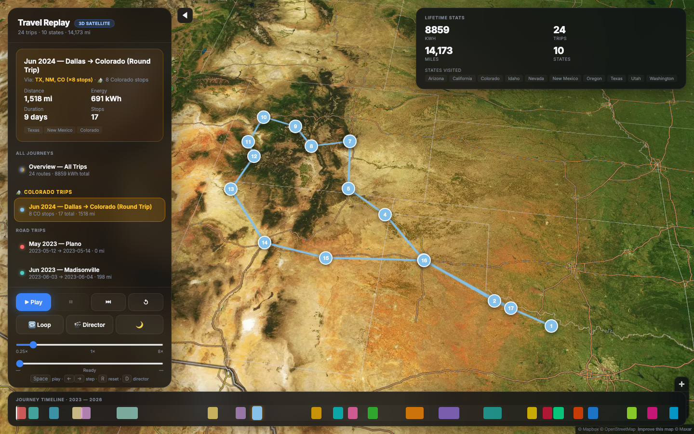
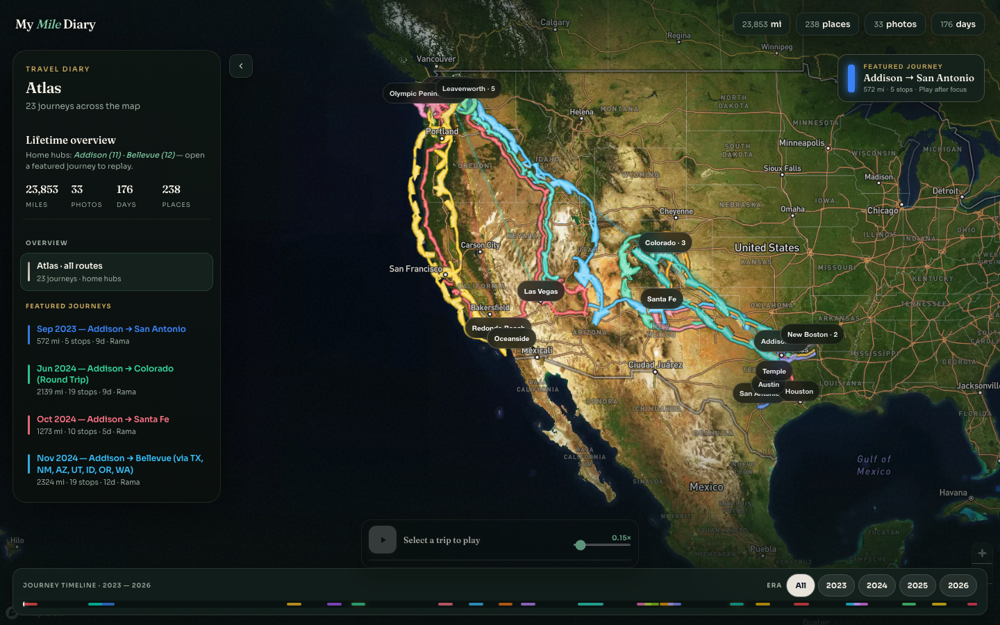
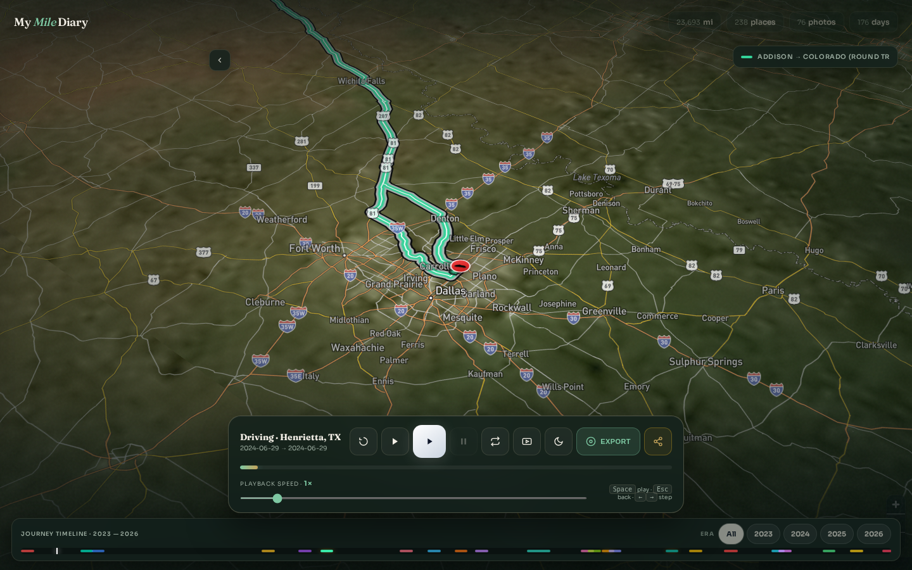
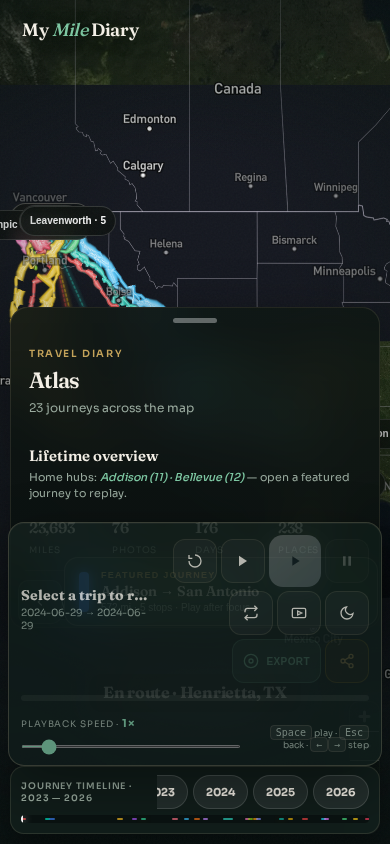

# My Mile Diary

A personal **travel diary** on a 3D satellite map — replay road trips, enrich paths with Apple Photos GPS, and hover memories along the route.


## Live demo

**https://ramkandimalla94.github.io/mymilediary/**

> **Rename step:** In GitHub → Settings → General, rename the repository to `mymilediary` so this Pages URL resolves. Until then the old Pages path may still be active.

The Mapbox **public** token (`pk.…`) is baked into the Pages build as base64 (decoded in the browser) so GitHub push protection does not block `gh-pages` deploys. Do not use a secret `sk.…` token.

Every merge to `main` rebuilds this site via GitHub Actions (`.github/workflows/pages.yml`) and publishes to the `gh-pages` branch (HTML + photo thumbs).

## Features

- **Atlas overview** — home hubs + destination constellation + corridor spokes; destination-grouped trip list
- **Featured journey CTA** — one clear “open a journey” action on the atlas (no mystery auto-reel)
- **Photo memories** — dump albums into `data/photos/<album>/`; EXIF GPS + time enrich the trip path to the **exact** photo location (hike destinations included); hover shows thumbnail previews
- **Year era filter** — isolate diary chapters by year
- **3D satellite map** with Mapbox terrain and elevated route lines
- **Watch mode** — Play hides chrome for a passenger-seat replay
- **Time-accurate playback** — overnight halts pace without long freezes
- **Location labels** — city/state names during replay
- **Video export** — one-click `.webm` with intro/outro title cards (9:16)

## Quick start (local)

```bash
git clone https://github.com/ramkandimalla94/mymilediary.git
cd mymilediary
python3 -m venv .venv && source .venv/bin/activate
pip install -r requirements.txt

cp .env.example .env
# Edit .env → MAPBOX_TOKEN=pk.eyJ...

python scripts/build_map.py
python -m http.server 8765
open http://127.0.0.1:8765/output/travel_map.html
```

### Trip history (CSV backbone)

Place travel/charging history CSV exports in the project root or `data/imports/`, then:

```bash
python scripts/merge_csvs.py
python scripts/geocode_locations.py   # first run only
python scripts/segment_trips.py
python scripts/build_map.py
```

Optional: copy `data/owner_config.json.example` → `data/owner_config.json` to pin home bases.

### Apple Photos → path enrichment

```bash
# data/photos/colorado/*.HEIC|jpg|png   (album folders)
python scripts/ingest_photos.py
python scripts/enrich_trips_with_photos.py
python scripts/build_map.py
```

- Originals stay in `data/photos/` (gitignored)
- Hover thumbs live in `output/photos/thumbs/<album>/`
- Metadata: `data/photos_index.json`, `data/trip_photos.json`

See [`data/photos/README.md`](data/photos/README.md).

## Screenshots

| Atlas overview | Colorado journey | Photo memories |
|----------|---------------|--------------|
|  |  |  |

| Watch mode | Featured CTA | Mobile sheet |
|------------|-------------|---------------------|
|  |  |  |

## GitHub Pages setup

1. Repo secret `MAPBOX_TOKEN` = public `pk.` token
2. Rename repo to `mymilediary` (Pages URL follows)
3. Merge to `main` → Actions deploys `gh-pages`

## Project layout

```text
data/
  photos/<album>/     # your dumps (gitignored)
  photos_index.json   # EXIF index
  trip_photos.json    # photos matched to trips
  trips.json
scripts/
  ingest_photos.py
  enrich_trips_with_photos.py
  build_map.py
  segment_trips.py
output/
  travel_map.html
  photos/thumbs/      # hover thumbnails (committed)
```

Personal travel diary — trip geometry may be derived from your own exports; photos are yours.
